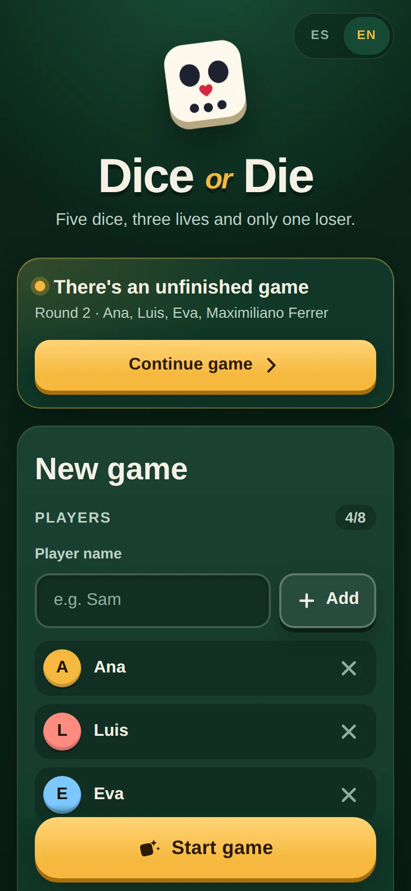
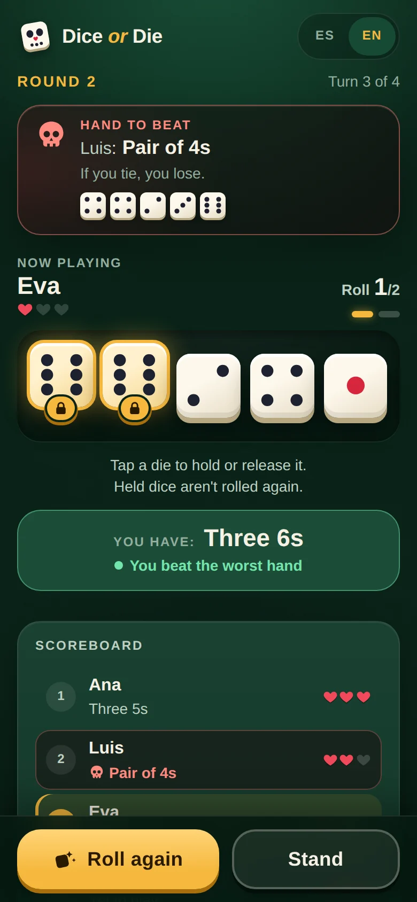
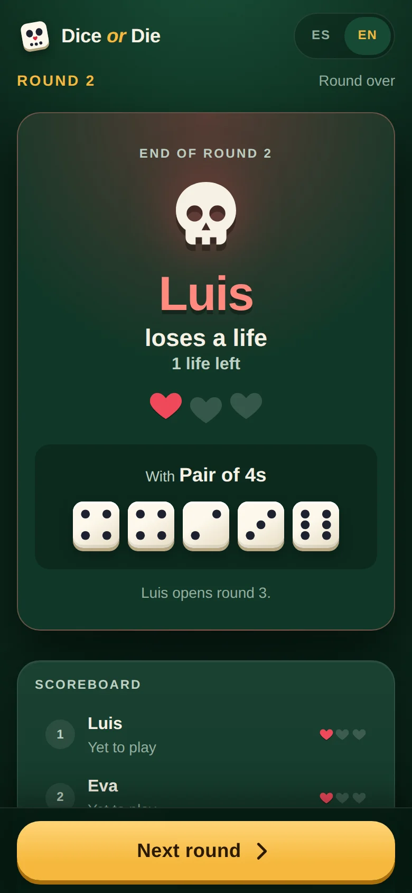
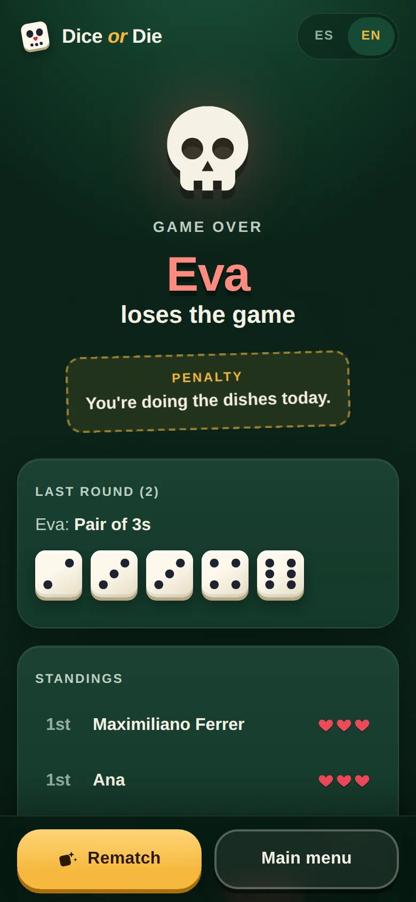

# Dice or Die

[](https://github.com/Pablodvs/TFG-dado-o-muerte-web/actions/workflows/ci.yml)
[](LICENSE)

A pass-and-play dice game for 2 to 8 players: everyone shares one phone, rolls five dice, holds the good ones and tries not to end the round with the worst hand.

**Play it at [dice-or-die.pablodiezdevelasco.com](https://dice-or-die.pablodiezdevelasco.com/)** · Versión en español: [README_ES.md](README_ES.md)

<p align="center">
  
  
  
  
</p>

## About the project

Version 1 (June 2023) was my final degree project (TFG): a React, Express and MySQL web version of the dice game. It is kept under the [`v1`](../../tree/v1) tag. Version 2 (2026) rewrites both sides:

- a REST API that owns the rules, with transactions, validation and translatable error codes;
- a mobile-first client with its own design, a pass-the-phone flow and English and Spanish;
- tests on both sides, CI, and a Docker image deployed with Coolify.

The code (identifiers, comments and commits) is in Spanish. A few words help when reading it: *partida* = game, *jugador* = player, *tirada* = roll, *plantarse* = stand, *ronda* = round, *vidas* = lives, *dados* = dice.

## Features

- A "pass the phone" screen between turns, so nobody sees the next player's dice.
- Tap a die to hold or release it.
- Live preview of your hand while you roll ("You have: Three 6s"), and a warning when it would lose.
- The hand to beat (the worst so far this round) is always visible.
- Round summary showing who lost a life and why.
- The game survives page reloads, including a half-played turn.
- Rematch with the same players.
- English and Spanish: it opens in English, and you can switch at any time from the header (your choice is remembered).
- Installable as an app (web manifest, standalone, portrait).

## How to play

- Each player starts with **3 lives**. The first player of round 1 is chosen at random.
- On your turn you roll **5 dice**. After a roll you may **hold** any dice (they will not be rerolled) and roll the rest again. Held dice can be released later.
- The **first player of each round** may roll up to 3 times and can stand at any moment. The number of rolls they used becomes the **roll limit** for everyone else in that round.
- Your final hand is **all 5 dice**, held or not, at the moment you stand.
- **1s are wild**: they count as whatever value helps your largest group. The exception is a straight, which cannot use wildcards.
- Hands are ranked by the size of the group of equal dice (more is better) and then by its value (higher is better). A **straight (2-3-4-5-6)** beats everything.
- When everyone has played, the **lowest hand loses a life**. On a tie, **whoever played later loses**.
- The loser starts the next round. The game ends when someone reaches 0 lives.

<details>
<summary>Examples and hand ranking</summary>

**Example 1**

| Player | Roll | Final hand |
|:--|:--|:--|
| 1 | 1, 2, 2, 5, 6 | three 2s (32) |
| 2 | 1, 1, 1, 4, 5 | four 5s (45) |
| 3 | 2, 2, 2, 4, 4 | three 2s (32) |
| 4 | 1, 1, 3, 4, 4 | four 4s (44) |

Players 1 and 3 tie with the lowest hand, so **Player 3 loses** because they played later. The best hand is Player 2's: four dice grouped, with a higher value than Player 4's.

**Example 2**

| Player | Roll | Final hand |
|:--|:--|:--|
| 1 | 1, 2, 2, 2, 6 | four 2s (42) |
| 2 | 2, 2, 3, 6, 6 | pair of 6s (26) |
| 3 | 2, 2, 2, 6, 6 | three 2s (32) |
| 4 | 2, 3, 4, 5, 6 | straight (60) |

**Player 2 loses**: they only managed a pair. The best hand is Player 4's straight.

**Hand ranking (lowest to highest)**

| Pair | Three of a kind | Four of a kind | Five of a kind |
|:--:|:--:|:--:|:--:|
| 2 2 | 2 2 2 | 2 2 2 2 | 2 2 2 2 2 |
| 3 3 | 3 3 3 | 3 3 3 3 | 3 3 3 3 3 |
| 4 4 | 4 4 4 | 4 4 4 4 | 4 4 4 4 4 |
| 5 5 | 5 5 5 | 5 5 5 5 | 5 5 5 5 5 |
| 6 6 | 6 6 6 | 6 6 6 6 | 6 6 6 6 6 |

**Highest: Straight (2 3 4 5 6).** Internally a group scores `size * 10 + value` (three 2s = 32) and a straight scores 60.

</details>

## Tech stack

| | |
|:--|:--|
| Client | React 18, Redux Toolkit, React Router, i18next, Vite |
| Server | Node 22, Express 5, MySQL 8 (`mysql2`), express-rate-limit |
| Tests | Vitest and Testing Library (client), `node:test` against a real MySQL (server) |
| Tooling | ESLint, GitHub Actions, Docker (multi-stage), Docker Compose, Coolify |

## Design decisions

- **The server owns the rules.** Scoring, turn order, the per-round roll limit and lives are decided in `servidor/partidas.js`. Each "stand" runs in a MySQL transaction that locks the game (`SELECT … FOR UPDATE`), so two simultaneous requests are processed one after the other.
- **Double taps are harmless.** Every stand request carries the round number. A repeated request arrives after the round has moved on and gets a 409, which the client resolves by reloading the game instead of showing an error.
- **Dice are rolled on the device.** The game is played on one shared phone, so the client rolls and the server validates what it receives: five values from 1 to 6, whose turn it is and how many rolls were used. Someone with the browser's dev tools could still send a straight; for online play, rolling would move to the server.
- **Scoring exists twice, checked by one test.** The client scores your hand as you roll, for the live preview. A test compares the client and server implementations on all 7,776 possible hands.
- **Reloading doesn't give free rolls.** A half-played turn is saved in `localStorage` under a game, round and player key, so a reload restores the dice and the roll count.
- **The API is public but not browsable.** Games are addressed by a random 128-bit ID (22 characters of base64url) instead of 1, 2, 3…, and creating games is rate-limited per IP.
- **Errors are translatable.** Every API error carries a stable `codigo`; the client shows it in the current language and falls back to the server's message for codes it doesn't know.
- **Accessibility.** Dice are toggle buttons with `aria-pressed` and spoken labels, focus moves to confirmation prompts, the language switcher names each language in that language, and animations respect `prefers-reduced-motion`.

## Getting started

Prerequisites: Node 22.12+ and MySQL 8 (or MariaDB). If you don't have MySQL, start one with Docker:

```bash
docker run -d --name dado-mysql -e MYSQL_ALLOW_EMPTY_PASSWORD=yes -p 3307:3306 mysql:8
```

```bash
cp servidor/.env.example servidor/.env      # with the container above, set DB_PORT=3307 in it
cd servidor && npm install
npm run db:init -- --esperar                # creates the database and tables (waits for MySQL to start)
cd ../cliente && npm install
```

Then run both sides in two terminals:

```bash
cd servidor && npm run dev      # API on http://localhost:3001
cd cliente && npm run dev       # app on http://localhost:3000 (proxies /api to 3001)
```

### Tests and lint

```bash
cd servidor && npm test          # node:test; the API tests need the database and are skipped without it
cd cliente && npm test -- --run  # Vitest (without --run it stays in watch mode)
cd cliente && npm run lint       # ESLint
```

GitHub Actions runs all of them on every push and pull request, with a MySQL service, and also builds the Docker image.

### Playing on your phone

Build the client and start the server; it serves `cliente/build` and prints every network address it finds:

```bash
cd cliente && npm run build
cd ../servidor && npm start
```

Open your computer's Wi-Fi address (for example `http://192.168.1.20:3001`) on a phone on the same network. Don't use `localhost` on the phone, and make sure the firewall allows port 3001.

## Deployment

The `Dockerfile` builds the client and runs the server, which serves the API and the app on port 3001. `docker-compose.yaml` adds its own MySQL. On startup the container creates or updates the tables. [docs/DEPLOYMENT.md](docs/DEPLOYMENT.md) covers Docker, Docker Compose, Coolify, Cloudflare Tunnel, the environment variables and `TRUST_PROXY` for the rate limit behind proxies.

## API

Base path `/api`. Everything is JSON. Errors are `{ "error": "<message in Spanish>", "codigo": "<stable code>" }`, and the client translates them by `codigo`. Every game endpoint returns the full game state (`EstadoPartida`), whose `id` is the game's public ID.

| Method | Path | Body | Success | Errors |
|:--|:--|:--|:--|:--|
| GET | `/api/health` | none | 200 `{ ok: true }` (checks the database) | 503 |
| POST | `/api/partidas` | `{ jugadores: string[] }` (2-8 unique names, 1-20 characters) | 201 `{ partida }` | 400, 429 |
| GET | `/api/partidas/:id` | none | 200 `EstadoPartida` | 400, 404 |
| POST | `/api/partidas/:id/plantarse` | `{ jugadorId, ronda, dados: number[5], tiradas }` | 200 `{ partida, rondaTerminada }` | 400, 404, 409 |

`ronda` must match the game's current round, otherwise the server answers 409. A rematch is a new `POST /api/partidas` with the same names.

## Project structure

```
.github/workflows/   CI: server tests with MySQL, client lint, tests and build, Docker image
Dockerfile           production image (builds the client and runs the server)
docker-compose.yaml  app + MySQL for Docker Compose / Coolify
docs/                deployment guide and screenshots
servidor/
  index.js           entry point (prints LAN URLs, shuts down cleanly on SIGTERM)
  app.js             Express app: rate limit, routes, serves cliente/build
  partidas.js        game rules, validation and persistence
  puntuacion.js      scoring
  idPublico.js       random public game IDs
  config.js, db.js   configuration and MySQL pool
  errores.js         HTTP errors with translatable codes
  db/                schema.sql, migracion-v1.sql, init.js
  test/              API (with MySQL), scoring, rate limit, IDs and db:init
cliente/
  index.html, vite.config.js, eslint.config.js
  src/
    pantallas/       screens: start, game, final
    componentes/     UI components (dice, hand, lives, turn, round summary...)
    hooks/           turn state, saved game, player list
    lib/             scoring, rules and local storage helpers
    slices/          Redux Toolkit slice for the game state
    idiomas/         translations (en, es)
    estilos/         CSS (tokens, base, and one file per screen)
    api.js           API client
```

## License

[MIT](LICENSE)
