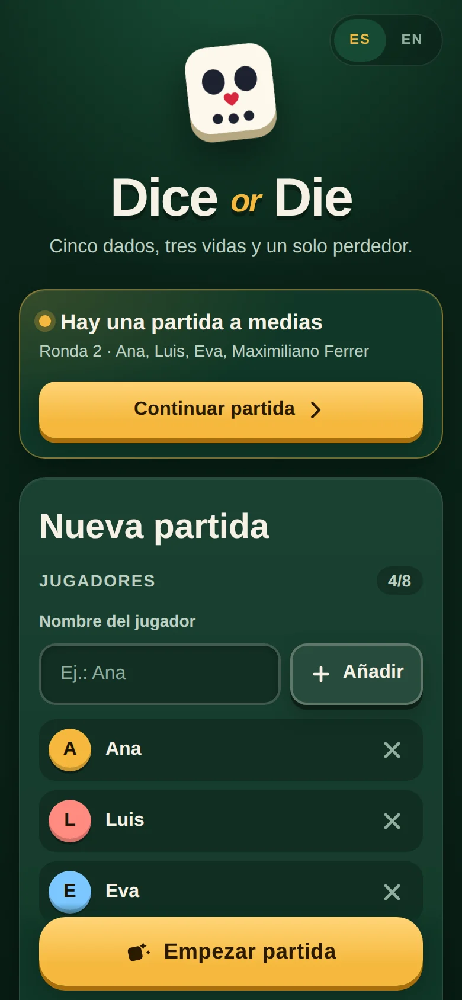
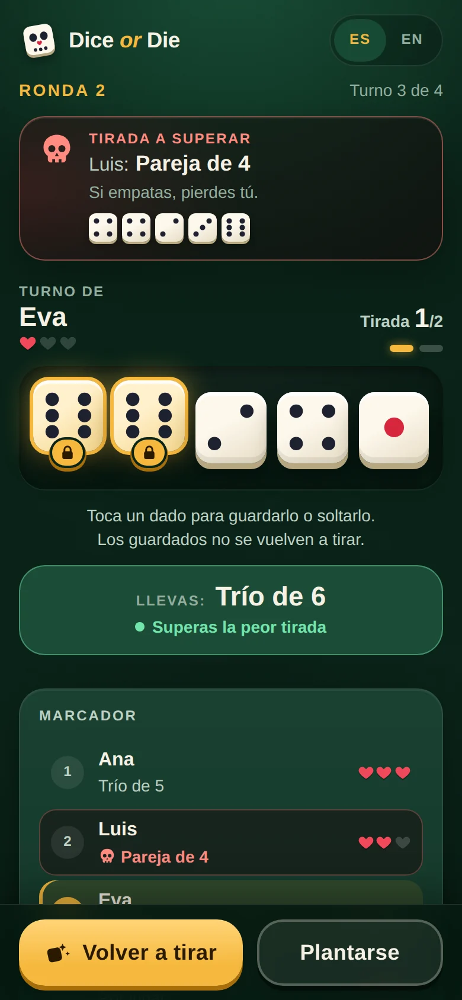
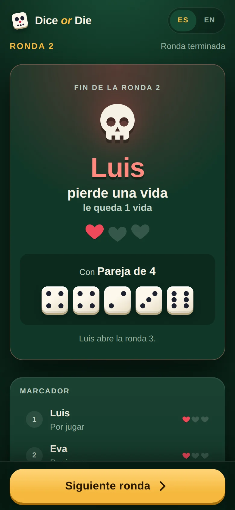
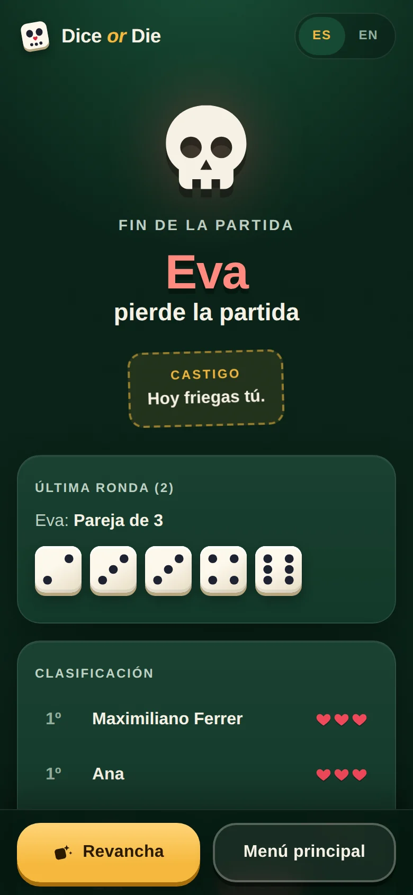

# Dice or Die

[](https://github.com/Pablodvs/TFG-dado-o-muerte-web/actions/workflows/ci.yml)
[](LICENSE)

Un juego de dados para 2 a 8 jugadores que se juega pasándose un único móvil: tira cinco dados, guarda los buenos y procura no acabar la ronda con la peor jugada.

**Juega en [dice-or-die.pablodiezdevelasco.com](https://dice-or-die.pablodiezdevelasco.com/)** · English version: [README.md](README.md)

<p align="center">
  
  
  
  
</p>

## Sobre el proyecto

La versión 1 (junio de 2023) fue mi trabajo de fin de grado (TFG): una versión web del juego de dados con React, Express y MySQL. Se conserva en la etiqueta [`v1`](../../tree/v1). La versión 2 (2026) reescribe las dos partes:

- una API REST que manda en las reglas, con transacciones, validación y códigos de error traducibles;
- un cliente pensado para el móvil, con diseño propio, el flujo de pasar el móvil y en inglés y castellano;
- tests en ambos lados, integración continua y una imagen Docker desplegada con Coolify.

## Características

- Pantalla de "pasa el móvil" entre turnos, para que nadie vea los dados del siguiente.
- Toca un dado para guardarlo o soltarlo.
- Vista previa de la jugada mientras tiras ("Llevas: Trío de 6"), y un aviso cuando perdería.
- La jugada a superar (la peor de la ronda hasta el momento) siempre a la vista.
- Resumen de ronda que indica quién pierde una vida y por qué.
- La partida sobrevive a recargar la página, incluso a mitad de un turno.
- Revancha con los mismos jugadores.
- En inglés y castellano: sale en inglés y se puede cambiar en cualquier momento desde la cabecera (la elección se recuerda).
- Se puede instalar como una app (manifiesto web, pantalla completa, vertical).

## Cómo se juega

- Cada jugador empieza con **3 vidas**. El primer jugador de la ronda 1 se elige al azar.
- En tu turno tiras **5 dados**. Tras cada tirada puedes **guardar** los dados que quieras (no se vuelven a tirar) y repetir con el resto. Los dados guardados se pueden soltar de nuevo.
- El **primer jugador de cada ronda** puede tirar hasta 3 veces y plantarse cuando quiera. Las tiradas que haya usado pasan a ser el **límite de tiradas** para todos los demás en esa ronda.
- Tu jugada final son **los 5 dados**, guardados o no, en el momento en que te plantas.
- **Los 1 son comodines**: se suman a tu grupo más numeroso. La excepción es la escalera, que no admite comodines.
- Las jugadas se ordenan primero por el tamaño del grupo de dados iguales (cuantos más, mejor) y después por su valor (cuanto más alto, mejor). La **escalera (2-3-4-5-6)** gana a todo.
- Cuando todos han jugado, **la jugada más baja pierde una vida**. En caso de empate, **pierde quien jugó después**.
- El perdedor de la ronda empieza la siguiente. La partida termina cuando alguien llega a 0 vidas.

<details>
<summary>Ejemplos y tabla de jugadas</summary>

**Ejemplo 1**

| Jugador | Tirada | Jugada final |
|:--|:--|:--|
| 1 | 1, 2, 2, 5, 6 | trío de 2 (32) |
| 2 | 1, 1, 1, 4, 5 | póker de 5 (45) |
| 3 | 2, 2, 2, 4, 4 | trío de 2 (32) |
| 4 | 1, 1, 3, 4, 4 | póker de 4 (44) |

Los jugadores 1 y 3 empatan con la jugada más baja, así que **pierde el jugador 3** por haber jugado después. La mejor jugada es la del jugador 2: agrupa cuatro dados y con un valor superior al del jugador 4.

**Ejemplo 2**

| Jugador | Tirada | Jugada final |
|:--|:--|:--|
| 1 | 1, 2, 2, 2, 6 | póker de 2 (42) |
| 2 | 2, 2, 3, 6, 6 | pareja de 6 (26) |
| 3 | 2, 2, 2, 6, 6 | trío de 2 (32) |
| 4 | 2, 3, 4, 5, 6 | escalera (60) |

**Pierde el jugador 2**, que solo consiguió agrupar 2 dados. La mejor jugada es la escalera del jugador 4.

**Tabla de jugadas (de menor a mayor)**

| Pareja | Trío | Póker | Repóker |
|:--:|:--:|:--:|:--:|
| 2 2 | 2 2 2 | 2 2 2 2 | 2 2 2 2 2 |
| 3 3 | 3 3 3 | 3 3 3 3 | 3 3 3 3 3 |
| 4 4 | 4 4 4 | 4 4 4 4 | 4 4 4 4 4 |
| 5 5 | 5 5 5 | 5 5 5 5 | 5 5 5 5 5 |
| 6 6 | 6 6 6 | 6 6 6 6 | 6 6 6 6 6 |

**La más alta: Escalera (2 3 4 5 6).** Internamente un grupo puntúa `tamaño * 10 + valor` (un trío de 2 = 32) y la escalera puntúa 60.

</details>

## Tecnologías

| | |
|:--|:--|
| Cliente | React 18, Redux Toolkit, React Router, i18next, Vite |
| Servidor | Node 22, Express 5, MySQL 8 (`mysql2`), express-rate-limit |
| Tests | Vitest y Testing Library (cliente), `node:test` contra un MySQL real (servidor) |
| Herramientas | ESLint, GitHub Actions, Docker (multietapa), Docker Compose, Coolify |

## Decisiones de diseño

- **El servidor manda en las reglas.** La puntuación, el orden de turnos, el límite de tiradas de cada ronda y las vidas se deciden en `servidor/partidas.js`. Cada "plantarse" se hace en una transacción de MySQL que bloquea la partida (`SELECT … FOR UPDATE`), así que dos peticiones simultáneas se procesan una detrás de otra.
- **Las dobles pulsaciones no hacen daño.** Cada petición de plantarse lleva el número de ronda. Una petición repetida llega cuando la ronda ya ha avanzado y recibe un 409, que el cliente resuelve recargando la partida en vez de mostrar un error.
- **Los dados se tiran en el dispositivo.** Se juega en un solo móvil compartido, así que el cliente tira y el servidor valida lo que recibe: cinco valores del 1 al 6, de quién es el turno y cuántas tiradas se han usado. Alguien con las herramientas de desarrollo del navegador podría mandar una escalera; para jugar en línea, las tiradas pasarían al servidor.
- **La puntuación está dos veces, y un test las compara.** El cliente puntúa la jugada mientras tiras, para la vista previa. Un test compara las implementaciones del cliente y del servidor con las 7.776 manos posibles.
- **Recargar no regala tiradas.** El turno a medias se guarda en `localStorage` con una clave de partida, ronda y jugador, así que al recargar vuelven los dados y el número de tiradas.
- **La API es pública, pero no se puede recorrer.** Las partidas se identifican con un id aleatorio de 128 bits (22 caracteres en base64url) en vez de 1, 2, 3…, y crear partidas tiene un límite por IP.
- **Los errores se traducen.** Cada error de la API lleva un `codigo` estable; el cliente lo muestra en el idioma actual y, si no conoce el código, usa el mensaje del servidor.
- **Accesibilidad.** Los dados son botones conmutables con `aria-pressed` y etiquetas leídas, el foco va a las preguntas de confirmación, el selector de idioma nombra cada idioma en ese idioma y las animaciones respetan `prefers-reduced-motion`.

## Puesta en marcha

Requisitos: Node 22.12+ y MySQL 8 (o MariaDB). Si no tienes MySQL, arranca uno con Docker:

```bash
docker run -d --name dado-mysql -e MYSQL_ALLOW_EMPTY_PASSWORD=yes -p 3307:3306 mysql:8
```

```bash
cp servidor/.env.example servidor/.env      # con el contenedor de arriba, pon DB_PORT=3307
cd servidor && npm install
npm run db:init -- --esperar                # crea la base de datos y las tablas (espera a que MySQL arranque)
cd ../cliente && npm install
```

Después arranca ambas partes en dos terminales:

```bash
cd servidor && npm run dev      # API en http://localhost:3001
cd cliente && npm run dev       # aplicación en http://localhost:3000 (redirige /api al 3001)
```

### Tests y lint

```bash
cd servidor && npm test          # node:test; los tests de la API necesitan base de datos y se omiten si no hay
cd cliente && npm test -- --run  # Vitest (sin --run se queda en modo watch)
cd cliente && npm run lint       # ESLint
```

GitHub Actions los ejecuta todos en cada push y pull request, con un MySQL de servicio, y además compila la imagen Docker.

### Jugar desde el móvil

Compila el cliente y arranca el servidor; sirve `cliente/build` e imprime todas las direcciones de red que encuentra:

```bash
cd cliente && npm run build
cd ../servidor && npm start
```

Abre la dirección de la wifi de tu ordenador (por ejemplo `http://192.168.1.20:3001`) en un móvil de la misma red. No uses `localhost` en el móvil, y comprueba que el cortafuegos deja pasar el puerto 3001.

## Despliegue

El `Dockerfile` compila el cliente y arranca el servidor, que sirve la API y la aplicación en el puerto 3001. `docker-compose.yaml` añade su propio MySQL. Al arrancar, el contenedor crea o pone al día las tablas. [docs/DESPLIEGUE.md](docs/DESPLIEGUE.md) explica Docker, Docker Compose, Coolify, Cloudflare Tunnel, las variables de entorno y `TRUST_PROXY` para el límite por IP detrás de proxies.

## API

Ruta base `/api`. Todo es JSON. Los errores tienen la forma `{ "error": "<mensaje en español>", "codigo": "<código estable>" }`, y el cliente los traduce por su `codigo`. Todos los endpoints de partida devuelven el estado completo (`EstadoPartida`), cuyo `id` es el id público de la partida.

| Método | Ruta | Cuerpo | Éxito | Errores |
|:--|:--|:--|:--|:--|
| GET | `/api/health` | ninguno | 200 `{ ok: true }` (comprueba la base de datos) | 503 |
| POST | `/api/partidas` | `{ jugadores: string[] }` (2-8 nombres únicos, 1-20 caracteres) | 201 `{ partida }` | 400, 429 |
| GET | `/api/partidas/:id` | ninguno | 200 `EstadoPartida` | 400, 404 |
| POST | `/api/partidas/:id/plantarse` | `{ jugadorId, ronda, dados: number[5], tiradas }` | 200 `{ partida, rondaTerminada }` | 400, 404, 409 |

`ronda` debe coincidir con la ronda actual de la partida; si no, el servidor responde 409. La revancha es un nuevo `POST /api/partidas` con los mismos nombres.

## Estructura del proyecto

```
.github/workflows/   CI: tests del servidor con MySQL; lint, tests y build del cliente; imagen Docker
Dockerfile           imagen de producción (compila el cliente y arranca el servidor)
docker-compose.yaml  aplicación + MySQL para Docker Compose / Coolify
docs/                guía de despliegue y capturas
servidor/
  index.js           punto de entrada (muestra las URL de red local, se cierra limpio con SIGTERM)
  app.js             aplicación Express: límite por IP, rutas, sirve cliente/build
  partidas.js        reglas, validación y persistencia de las partidas
  puntuacion.js      puntuación
  idPublico.js       ids públicos aleatorios de partida
  config.js, db.js   configuración y pool de MySQL
  errores.js         errores HTTP con códigos traducibles
  db/                schema.sql, migracion-v1.sql, init.js
  test/              API (con MySQL), puntuación, límite, ids y db:init
cliente/
  index.html, vite.config.js, eslint.config.js
  src/
    pantallas/       pantallas: inicio, partida y final
    componentes/     componentes de la interfaz (dados, jugada, vidas, turno, resumen de ronda...)
    hooks/           estado del turno, partida guardada, lista de jugadores
    lib/             puntuación, reglas y almacenamiento local
    slices/          slice de Redux Toolkit con el estado de la partida
    idiomas/         traducciones (en, es)
    estilos/         CSS (tokens, base y un fichero por pantalla)
    api.js           cliente de la API
```

## Licencia

[MIT](LICENSE)
